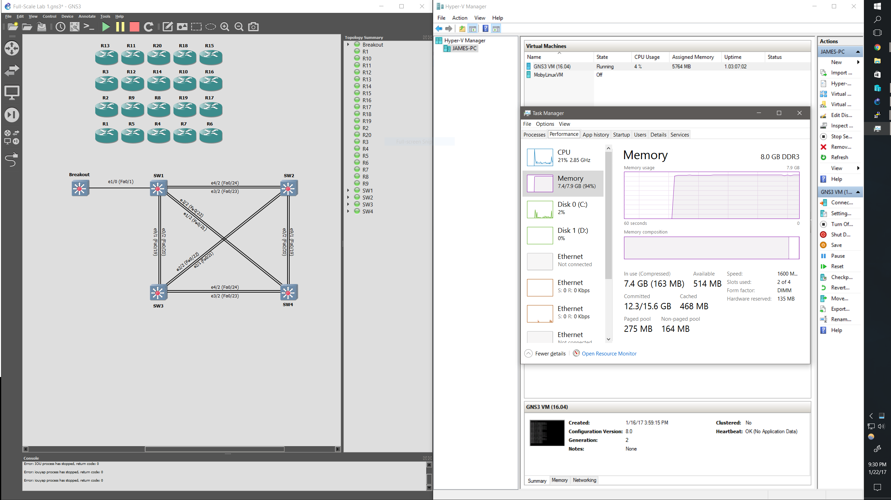

With Windows 10 Pro, you have the option of using a Windows native hypervisor called Hyper-V. It's included with the OS so you
don't have to pay the high price of something like VMWare Workstation while still getting great performance. I set it up with the default option of using Dynamic Memory so that it won't use much ram until you
start adding a lot of routers and switches and it will scale up the VM's available RAM as needed. I simulated the INE CCIE R/S topology 
on it with 20 routers and 5 switches, and sat at around 6GB memory consumption of the VM and my total system ram usage right up at 7.6GB
of 8GB total. I didn't notice any issues at all though, and I think that Hyper-V will scale the VM back and 
give more to the host if it needs it. Overall it feels much better than using VMWare Player which always opened up a window when starting GNS3. 
With this option, you just set Hyper-V to boot your VM automatically when you boot your desktop and it will always be in the background, available for you to use as a remote sever from GNS3. 

If you give your VM a static IP, you can even setup a VPN so you can remotely access the lab from anywhere you have the internet.

### What it looks like running INE's full CCIE RS v5 topology

### Requirements
- Windows 10 Pro / Education / Enterprise
- Hyper-V feature enabled
- 8GB ram

### Just give me the VHDX
Username: gns3
Password: gns3

[Hyper-V Image](https://drive.google.com/file/d/0BzbEOs7IPJamMkNZdHo4S09fUEU/view?usp=sharing)

### How-to build your own

0. Download [Ubuntu 16.04 Server](https://www.ubuntu.com/download/server/thank-you?country=US&version=16.04.1&architecture=amd64)
1. Create a Virtual Switch
    - Action -> Virtual Switch Manager
    - Create Virtual Switch
        - Chose External so you can access it from other computers on your network and the internet
    - Name it GNS3 VM Switch
    - Bind it to whatever interface gets to the internet
2. Make a New VM
    - Action -> New -> Virtual Machine
    - Name -> GNS3 VM
    - Choose Gen 2
    - I use 1024MB RAM, and allow Dynamic Memory to add more if needed
    - Connect it to GNS3 VM Switch
    - Create a virtual hard disk - I used 20GB
    - Install an operating system from a bootable image file
        - Browse to where you downloaded your Ubuntu server iso
3. Change secure boot to Microsoft UEFI Certificate Authority and Set Auto Boot
    - VM Settings -> Security -> Template -> Microsoft UEFI Certificate Authority
    - VM Settings -> Automatic Start Action
        - Always start this virtual machine automatically
4. Install Ubuntu
    - Connect and power on the VM
    - Install Ubuntu Server
    - Enter 5x for US layout
    - Hostname: gns3vm
    - Full name is optional
    - Username: gns3
    - Password: gns3
    - Use weak password: yes (up to you obviously)
    - Encrypt: no
    - Timezone: up to you
    - Partition Disks: I use all defaults here
        - LVM
        - SCSI1
        - Write Changes: Yes
        - Amount of volume group to use: default - enter
        - Force UEFI: Yes
        - Write Changes: Yes
    - HTTP Proxy: blank
    - Install security updates automatically
    - Scroll down and choose OpenSSH server with the space bar
    - Installation Complete - Continue
5. Configure Ubuntu and Install GNS3 Server
    - Login with gns3/gns3
    - Get the mac address and create a static entry in your dhcp server
        ~~~bash
        ip add
        ~~~ 

        - get the mac of eth0
        - reboot to get new lease

        ~~~bash
        sudo reboot
        ~~~
    - You can now ssh to your VM on the address you reserved
        ~~~bash
        sudo apt update; sudo apt upgrade
        ~~~
    - Its usually worth a restart after your first upgrade to get the latest kernel
        ~~~bash
        sudo reboot
        ~~~
    - Install GNS3
        ~~~bash
        sudo -s

        add-apt-repository ppa:gns3/ppa
        apt update
        apt install gns3-server
        apt install gns3-iou
        ~~~

        ~~~bash
        nano /etc/systemd/system/gns3.service
        ~~~

        - [Paste this in](/static/gns3.service)
        - ctrl+o, ctrl+x to save and exit 
        - enable and start the gns3 service
            - systemctl enable gns3
            - systemctl start gns3
            - systemctl status gns3 to verify it's active (running)
6. Configure GNS3 to Point to Your Remote Server
    - Edit -> Preferences -> Server -> Remote Servers
        - Add, just update the Host to the IP of your VM that you reserved earlier
    - When you go to add IOU devices, choose remote computer and run on the IP you chose.
    - If you have issues with your iourc just paste it manually in ~/.iourc under your gns3 account

