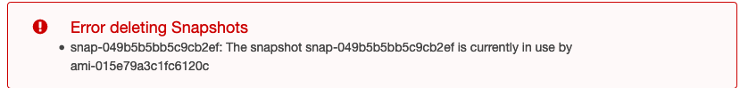

This sprint I have a ticket from the security team to investigate unencrypted snapshots in our AWS account and either encrypt them or delete them if no longer needed.
In my initial attempt I just used the AWS web console, filtered by "Encryption: Not Encrypted" in the snapshots section, and attempted to delete that list.

But it would make for a boring story if things were that simple: 



The snapshots still seem to be in use by AMIs :thinking:

Since there's over 100 snapshots to work with, doing anything manual here doesn't makes sense.

## Xonsh
For the past couple weeks I've been using https://xon.sh as my shell, which is essentially a Python interpreter that has nice syntax for running shell commands. So you have all the power of Python right in the familiar shell environment.

I used this command to get all of the unencrypted snapshots from the CLI:

```
aws ec2 describe-snapshots --owner-ids <AWS_ACCOUNT_ID> --filters Name=encrypted,Values=false
```

This outputs a JSON list of snapshot objects with output similar to:
```
[
    {
        'Description': 'Created by CreateImage(i-0655ec555df7301a3) for ami-05d88b65555fc7ac8 from vol-9153c2e41d1d1435e',
        'Encrypted': False,
        'OwnerId': '<AWS_ACCOUNT_ID>',
        'Progress': '100%',
        'SnapshotId': 'snap-08555c8b19cafefe4',
        'StartTime': '2019-08-28T19:43:35.194000+00:00',
        'State': 'completed',
        'Tags': [{'Key': 'source_ami', 'Value': 'ami-0cb990abf5557fa3b'},
            {'Key': 'source_ami_name', 'Value': '<no value>'},
            {'Key': 'timestamp', 'Value': '1567021255'}],
        'VolumeId': 'vol-9153c2e41d1d1435e',
        'VolumeSize': 30
    },
    {...}
]
```

So, the task then is to get the AMI id from the unencrypted snapshot's description, compile a list of AMIs, and then deregister that list of AMIs before deleting the snapshots.

My first thought was to just use grep with some regex to return all AMI ids in the output. This won't work though because the tags contain a source_ami AMI id which is not an AMI we want to deregister.

Since my shell is just Python, and we're dealing with JSON I can just `import json` and process the `aws` CLI output natively with standard Python:
```
output = $(aws ec2 describe-snapshots --owner-ids <AWS_ACCOUNT_ID> --filters Name=encrypted,Values=false)
import json
json_snapshots = json.loads(output)
```

Cool, so `json_snapshots['Snapshots'][0]` will get me the first snapshot and `json_snapshots['Snapshots'][0]['Description']` will get me just the description (containing the AMI id of the AMI we need to deregister).

Now we need to create a list of snapshot descriptions:
```
snapshot_descriptions = []
snapshots = json_snapshots['Snapshots']
for snapshot in snapshots: 
     snapshot_descriptions.append(snapshot['Description']) 
```

Now we should filter this list of descriptions, extracting all AMI Ids found into a new list. Again since the shell is a Python interperetor, we can just `import re` to do regex:
```
import re
pattern = 'ami-[^ ]*'
re.search(pattern, snapshot_descriptions[0]).group()
```

Great, this returns just the AMI id of the first snapshot_description.
Now lets make a new list with all the AMI ids to deregister:
```
snapshot_amis = []
for description in snapshot_descriptions:
    match = re.search(pattern, description)
    if match:
        ami = match.group()
        snapshot_amis.append(ami)
```

Awesome!! Now we have a clean list of potential AMIs to deregister. Before bulldozing over the list with a delete operation, let's first take a quick look at each AMI's info for a sanity check so far.

With xonsh, we can interleave Python and shell commands so its easy to loop over a CLI command using the `@(python_variable)` syntax to access a Python variable as a command arg:
```
for ami in snapshot_amis:
    print("Info for AMI: " + ami)
    aws ec2 describe-instances --filters Name=image-id,Values='@(ami)'
```
* Thanks to [this stackoverflow answer](https://stackoverflow.com/a/47420339/13666028) for the @() syntax I wouldn't have found it otherwise.

Phew looks like no EC2 instances are using any of these AMIs. Lets loop over the AMIs again and just take a quick look at the creation date, description, and tags, this time using the `aws` CLI's built-in query option instead of using Python's json:
```
for ami in snapshot_amis:
    print("Info for AMI: " + ami)
    aws ec2 describe-images --image-ids @(ami) --query 'Images[0].{CreationDate:CreationDate,Description:Description,Tags:Tags}'
```

Everything seems fine, all of the AMIs were created a year or more ago. Let's deregister
```
for ami in snapshot_amis:
    print("Deregistering AMI: " + ami)
    aws ec2 deregister-image --image-id @(ami)
```

And finally let's see if we can delete those snapshots now:

```
for snapshot in snapshots:
    snapshot_id = snapshot['SnapshotId']
    print("Deleting snapshot: " + snapshot_id)
    aws ec2 delete-snapshot --snapshot-id @(snapshot_id)
```

Are there any remaining unencrypted snapshots now?
```
aws ec2 describe-snapshots --owner-ids <AWS_ACCOUNT_ID> --filters Name=encrypted,Values=false 
```

Aaaand in my case there were three remaining snapshots, what gives? Turns out the remaining three all were missing an AMI id in their description, so the `re.search` didn't deregister those snapshot's associated AMIs. 

Since its just three snapshots, I'm going to one by one try to delete them from the console to get the AMI id to deregister.

...

All cleaned up now! And without a single line of shell script :tada::tada::tada:
```
aws ec2 describe-snapshots --owner-ids <AWS_ACCOUNT_ID> --filters Name=encrypted,Values=false                                         
{
    "Snapshots": []
}
```

